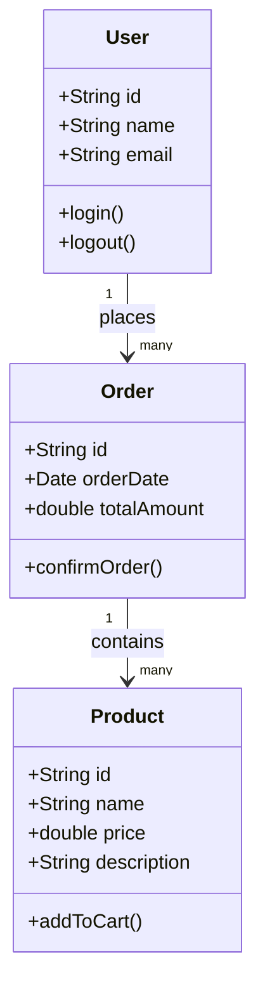

# Class Diagram

```mermaid
classDiagram
    class User {
      +String id
      +String name
      +String email
      +login()
      +logout()
    }

    class Product {
      +String id
      +String name
      +double price
      +String description
      +addToCart()
    }

    class Order {
      +String id
      +Date orderDate
      +double totalAmount
      +confirmOrder()
    }

    User "1" --> "many" Order : places
    Order "1" --> "many" Product : contains
```